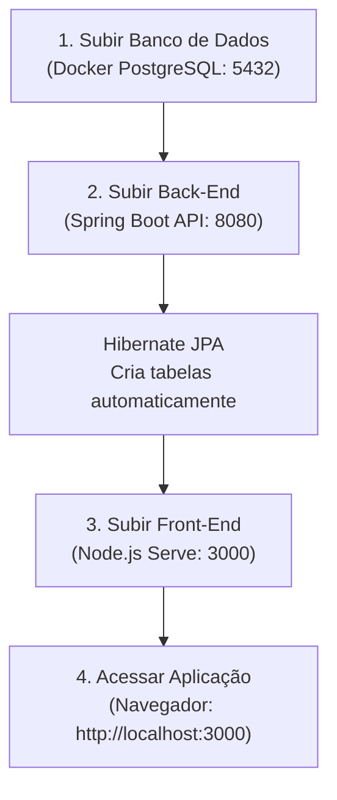

# Bilhetinho — WEBGUI

> MVP desenvolvido para a disciplina de **Engenharia de Software**  
> Pós-Graduação em Engenharia de Software — PUC-Rio

---

## Autor

Marcelo M. Caetano  
[https://www.linkedin.com/in/marcelomcaetano/](https://www.linkedin.com/in/marcelomcaetano/)  

---

## Sobre o Projeto

O **Bilhetinho WEBGUI** é o projeto centralizador e orquestrador da solução **Bilhetinho**. Ele integra o ecossistema completo do produto, cujo objetivo é digitalizar e modernizar a tradicional interação entre o público e os músicos em apresentações ao vivo em bares, restaurantes e casas de show.

Em vez de escrever pedidos de música em guardanapos de papel ou depender de garçons, o público envia suas solicitações diretamente do smartphone (via leitura de QR Code), enquanto os músicos visualizam, aceitam e rejeitam os pedidos em tempo real diretamente em seu painel artístico no palco.

---

## Arquitetura do Ecossistema

O repositório orquestrador conecta dois módulos independentes gerenciados como **Git Submodules**:

* **📁 [`bilhetinho-api`](bilhetinho-api/):**  
  Módulo de **Back-End (API RESTful)** construído com **Java 21** e **Spring Boot 3**. Responsável pelas regras de negócio, persistência de dados no **PostgreSQL**, integração com o Web Service dos Correios (**ViaCEP**) e disponibilização dos endpoints REST documentados via **OpenAPI 3 / Swagger UI**.

* **📁 [`bilhetinho-ui`](bilhetinho-ui/):**  
  Módulo de **Front-End (Web GUI)** construído em **Vanilla JavaScript modular (ES6 Modules)**, **HTML5** e **Bootstrap 5.3 (Dark Mode nativo)**. Totalmente responsivo e sem a necessidade de frameworks pesados ou processos lentos de compilação. Integra-se à **iTunes Search API (Apple)** para sugestões e autocomplete em tempo real de músicas e artistas.

---

## Pré-requisitos do Ambiente

### 🚀 Para Execução via Docker (Recomendado para Avaliação)

Para clonar e executar toda a solução integrada, você precisa **apenas de**:

1. **[Git](https://git-scm.com/):** Para clonagem do repositório com os submódulos (`--recurse-submodules`).
2. **[Docker Desktop](https://www.docker.com/products/docker-desktop/):** Para subir todos os containers integrados (Banco, API e Interface) com um único comando (`docker compose up --build`).
3. **Conexão com a Internet:** Para download das imagens/dependências no primeiro build e consumo em tempo real das APIs públicas (**ViaCEP** e **iTunes Search API**).

> [!NOTE]
> **Zero Instalação de Java ou Node.js:**  
> O avaliador **não** precisa instalar Java, Maven ou Node.js na sua máquina! O ambiente de compilação da API (Java 21 + Maven) e o servidor web Nginx do front-end estão 100% encapsulados e isolados dentro dos containers Docker.

---

### 💻 Para Desenvolvimento Local sem Docker (Opcional)

Apenas caso deseje compilar e depurar os serviços manualmente fora do Docker:

* **[Java 21 JDK](https://adoptium.net/temurin/releases/?version=21):** Para compilar e rodar a API Spring Boot no terminal ou IDE.
* **[Node.js](https://nodejs.org/):** Para servir os arquivos estáticos do front-end com servidor HTTP local (`npx serve`).

---

## Clonando o Projeto com Submódulos

Como o projeto orquestrador utiliza submódulos Git, clone utilizando o parâmetro `--recurse-submodules`:

```bash
git clone --recurse-submodules https://github.com/marcelomcaetano/bilhetinho-webgui.git
cd bilhetinho-webgui
```

> [!TIP]
> Caso já tenha clonado o repositório sem a flag `--recurse-submodules`, inicialize e baixe o conteúdo das pastas dos submódulos executando na raiz do projeto:
>
> ```bash
> git submodule update --init --recursive
> ```

---

## Guia de Execução

### Opção 1: Execução Completa em 1 Comando via Docker Compose (Recomendado para Avaliação)

A forma mais rápida, padronizada e moderna de subir todo o ecossistema integrado (Banco de Dados PostgreSQL + API Spring Boot + Interface Web Nginx) é utilizando o **Docker Compose**.

1. Na raiz do projeto `bilhetinho-webgui`, execute:

   ```bash
   docker compose up --build
   ```

   *(Ou adicione a flag `-d` para executar em segundo plano: `docker compose up --build -d`)*

2. O Docker Compose irá:
   * Subir o container `bilhetinho-pg` (PostgreSQL 16) com volume persistente e aguardar a checagem de integridade (*healthcheck*).
   * Construir a imagem da `bilhetinho-api` com Maven e Java 21 e iniciá-la na porta `8080`. O Hibernate criará todas as tabelas automaticamente.
   * Construir a imagem da `bilhetinho-ui` com servidor Nginx Alpine e iniciá-la na porta `3000`.

3. Para encerrar todos os containers e redes:

   ```bash
   docker compose down
   ```

---

### Opção 2: Execução Manual para Desenvolvimento Local (Passo a Passo)

Caso deseje executar os serviços de forma individual durante o desenvolvimento diário, siga a ordem abaixo:



---

### Passo 1: Subir o Banco de Dados PostgreSQL via Docker

A forma mais rápida e limpa de rodar o banco de dados é através de um container Docker oficial do PostgreSQL.

Execute o comando abaixo no terminal:

```bash
docker run -d \
  --name bilhetinho-pg \
  -e POSTGRES_DB=bilhetinho_db \
  -e POSTGRES_USER=postgres \
  -e POSTGRES_PASSWORD=postgres \
  -p 5432:5432 \
  postgres:16-alpine
```

#### Parâmetros Utilizados

* `--name bilhetinho-pg`: Nome amigável atribuído ao container.
* `-e POSTGRES_DB=bilhetinho_db`: Cria automaticamente o banco de dados `bilhetinho_db` na inicialização.
* `-e POSTGRES_USER=postgres`: Define o usuário padrão do banco.
* `-e POSTGRES_PASSWORD=postgres`: Define a senha de acesso (compatível com as configurações padrão da API).
* `-p 5432:5432`: Mapeia a porta padrão `5432` do container para o host local.
* `postgres:16-alpine`: Imagem leve e otimizada baseada em Alpine Linux.

> [!NOTE]
> **Criação Automática das Tabelas pelo Hibernate:**
> O container Docker criará o banco de dados `bilhetinho_db`. Não é necessário executar nenhum script SQL manual para criar tabelas!  
> Ao iniciar a API no **Passo 2**, o **Hibernate JPA** (configurado com `spring.jpa.hibernate.ddl-auto: update`) irá inspecionar as entidades do sistema (`Musico`, `Evento`, `EventoEndereco`, `Bilhetinho`) e **gerar automaticamente todas as tabelas, colunas, chaves primárias, chaves estrangeiras, sequências e restrições relacionais**.

---

### Passo 2: Subir a API Back-End (`bilhetinho-api`)

Com o banco de dados em execução, abra um terminal e navegue até a pasta da API:

```bash
cd bilhetinho-api
```

Execute a aplicação utilizando o Maven Wrapper incluído no projeto:

* **No Windows (PowerShell / CMD):**

  ```powershell
  .\mvnw.cmd spring-boot:run
  ```

* **No Linux ou macOS:**

  ```bash
  chmod +x ./mvnw
  ./mvnw spring-boot:run
  ```

#### Validação do Back-End

* A API subirá na porta **`8080`**.
* Assim que o log indicar `Started BilhetinhoApiApplication in ... seconds`, você pode validar o funcionamento acessando a documentação interativa Swagger no seu navegador:
  * **Swagger UI:** [http://localhost:8080/swagger-ui.html](http://localhost:8080/swagger-ui.html)
  * **OpenAPI Docs (JSON):** [http://localhost:8080/api-docs](http://localhost:8080/api-docs)

---

### Passo 3: Subir a Interface Front-End (`bilhetinho-ui`)

Abra um **novo terminal** (mantendo a API rodando no anterior) e navegue até a pasta do front-end:

```bash
cd bilhetinho-ui
```

Inicie o servidor estático local utilizando o pacote `serve` via `npx`:

```bash
npx -y serve -p 3000
```

#### Por que é necessário executar via servidor HTTP (`npx serve`)?
>
> [!IMPORTANT]
> O front-end utiliza **Módulos Nativos do JavaScript moderno (ES6 Modules)** com declarações `import` e `export`.
> Navegadores modernos bloqueiam o carregamento de módulos JavaScript quando os arquivos são abertos diretamente pelo sistema de arquivos (`file:///`) devido a restrições de segurança (política de CORS).
> Ao rodar com `npx -y serve -p 3000`, a aplicação é servida pelo protocolo HTTP em `http://localhost:3000`, permitindo a importação dos scripts modulares e a comunicação fluida com a API local (`http://localhost:8080/api`).

---

## Pontos de Acesso da Aplicação

Com todos os serviços em execução, acesse os seguintes endereços no navegador:

| Módulo / Funcionalidade | URL de Acesso | Descrição |
| --- | --- | --- |
| **Página Inicial (Vitrine de Shows)** | [http://localhost:3000](http://localhost:3000) ou [http://localhost:3000/index.html](http://localhost:3000/index.html) | Lista de apresentações ativas com botão "Acessar Show". |
| **Área do Músico** | [http://localhost:3000/musico.html](http://localhost:3000/musico.html) | Login por e-mail, cadastro de shows com busca por CEP e gestão inline da fila de pedidos (aceitar/rejeitar). |
| **Área de Pedidos (Público / QR Code)** | [http://localhost:3000/bilhetinho.html](http://localhost:3000/bilhetinho.html) | Envio de pedidos de música com sugestões em tempo real via iTunes Search API. |
| **Swagger UI (Documentação da API)** | [http://localhost:8080/swagger-ui.html](http://localhost:8080/swagger-ui.html) | Documentação interativa de todos os endpoints REST. |
| **Banco de Dados (PostgreSQL)** | `localhost:5432` | Banco `bilhetinho_db` gerenciado pelo container `bilhetinho-pg`. |

---

## Variáveis de Ambiente e Customizações Opcionais

Caso precise alterar configurações de banco ou portas, você pode sobrescrever as variáveis padrão informando-as no momento da execução:

### Back-End (`bilhetinho-api`)

As variáveis podem ser passadas antes do comando ou configuradas no arquivo `bilhetinho-api/src/main/resources/application.yml`:

| Variável | Valor Padrão | Descrição |
| --- | --- | --- |
| `SERVER_PORT` | `8080` | Porta HTTP da API |
| `DB_HOST` | `localhost` | Endereço do servidor PostgreSQL |
| `DB_PORT` | `5432` | Porta do PostgreSQL |
| `DB_NAME` | `bilhetinho_db` | Nome da base de dados |
| `DB_USER` | `postgres` | Usuário do banco de dados |
| `DB_PASSWORD` | `postgres` | Senha de acesso ao banco |

### Front-End (`bilhetinho-ui`)

A URL base da API consumida pelo front-end é configurada centralizadamente em [`bilhetinho-ui/js/api/client.js`](bilhetinho-ui/js/api/client.js):

```javascript
const BASE_URL = 'http://localhost:8080/api';
```

---

## Comandos Úteis para Parar ou Reiniciar os Serviços

* **Parar o Banco de Dados:**

  ```bash
  docker stop bilhetinho-pg
  ```

* **Iniciar o Banco de Dados Novamente:**

  ```bash
  docker start bilhetinho-pg
  ```

* **Remover o Container do Banco de Dados:**

  ```bash
  docker rm -f bilhetinho-pg
  ```

* **Parar a API ou o Front-End:**  
  Pressione `Ctrl + C` no terminal correspondente.
